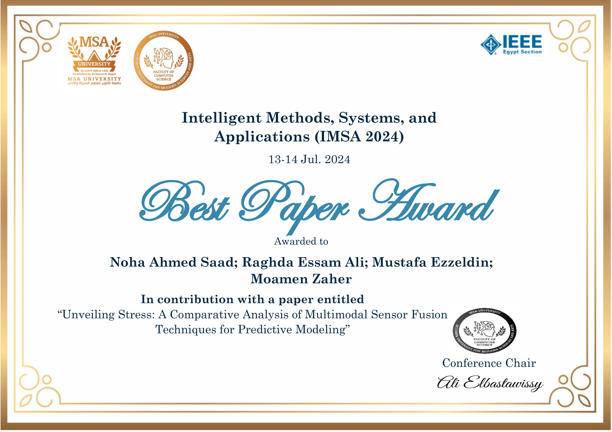

  

  

  <!-- 


  


  

 -->

I am honored to announce that our paper "Unveiling Stress: A Comparative Analysis of Multimodal Sensor Fusion Techniques for Predictive Modeling" was awarded best paper award at the 2024 2nd [Intelligent Methods, Systems, and Applications (IMSA)](http://imsa.msa.edu.eg/) conference.

IMSA is an international conference sponsered by IEEE. You can access the paper using the [DOI](https://doi.org/10.1109/IMSA61967.2024.10652655).

Special thanks to all my teammates :
- Raghda Essam  [LinkedIn](https://www.linkedin.com/in/raghdaali/)
- Noha Ahmed  [LinkedIn](https://www.linkedin.com/in/noha-ahmed-saad-eldien-b4209a284/)
- Mustafa Ezzelin  [LinkedIn](https://www.linkedin.com/in/mustafa-ezzeldin-549b101a2/)

<!--  -->

I am deeply grateful for this recognition and look forward to continuing my efforts to conduct high quality research in my academic journeys.

