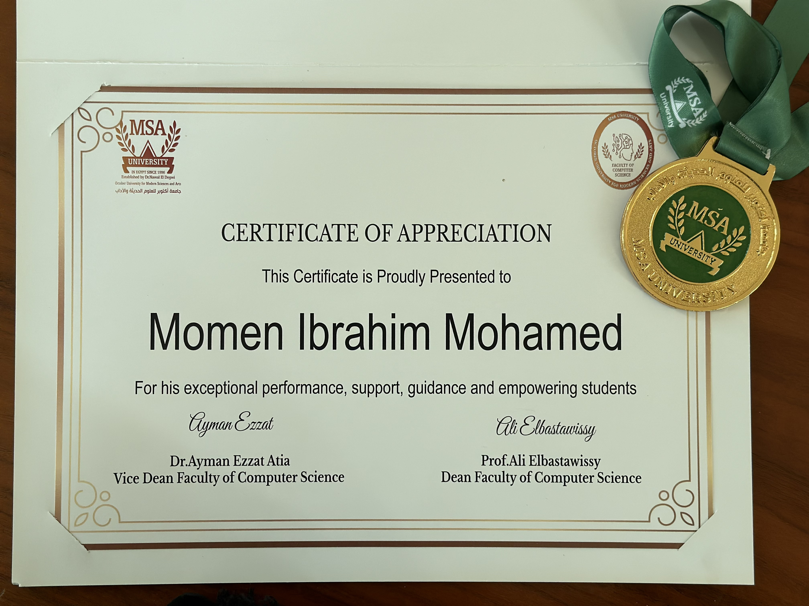

I am honored to announce that I have been selected as the Teaching Assistant of the Year for the Faculty of Computer Sciences at October University for Modern Sciences and Arts (MSA) for the academic year 2023/2024.

### Achievements During the Year
- ***Co-supervising Graduation Projects:***
I co-supervised 5 graduation projects involving a total of 8 students. These projects were highly successful, resulting in 7 accepted or published conference papers and 1 draft journal paper.

- ***Research Publications:***
This year, I successfully published 2 journal publications for my master’s research and have 2 more accepted journal papers, contributing to the academic community with significant findings.

- ***Teaching Excellence:***
I taught several courses, including Human-Computer Interaction (HCI), Machine Learning, Service-Oriented Architecture, and Software Engineering for senior students. The students' projects from these courses won the best project awards during the faculty day, showcasing their exceptional work and dedication.

- ***Event Organization:***
I played a key role in organizing several events such as the Faculty Day (Deep Minds) and the International Conference of Intelligent Methods, Systems, and Applications (AN IEEE conference). These events provided valuable platforms for students and professionals to share knowledge and innovations.

- ***Control and Exam Unit Contributions:***
As a member of the control and exam unit, I contributed to maintaining academic standards and ensuring the smooth conduct of exams.

- ***Student Guidance and Support:***
Throughout the year, I provided continuous guidance and support to students during their courses and graduation projects, helping them achieve their academic and professional goals.

I am deeply grateful for this recognition and look forward to continuing my efforts to inspire and support students in their academic journeys.

<!-- I am thrilled to announce that I have successfully passed the Pre-defense seminar for my master's thesis. My thesis explores the application of Human Activity Recognition (HAR) in the context of physical rehabilitation exercises, aiming to provide real-time feedback and assessment. Here are some key aspects of my research:

- **Objective**: The research investigates various machine learning and deep learning techniques, including transfer learning and attention models, to accurately recognize and evaluate physical movements. 🏋️‍♂️
- **Methodology**: By utilizing Kinect and RGB cameras, the study ensures accessibility and cost-effectiveness, making advanced rehabilitation technologies more widely available. 📷
- **Findings**: Through a comparative study of machine learning algorithms, a case study on a newly developed framework for assessing rehabilitation exercises, and an analysis of CNN and RNN algorithms across multiple datasets, the thesis offers comprehensive insights into the effectiveness of different approaches. 📊
- **Contributions**: Additionally, the work includes a study on transfer learning and model fusion techniques to enhance HAR performance. The results contribute to the advancement of real-time monitoring systems, providing valuable support for patients and healthcare professionals in the rehabilitation process. 🚀

I would like to express my gratitude to my supervisors, Assoc. Prof. [Ayman Ezzat](https://www.linkedin.com/in/ayman4/), Dr. [Amr Ghoniem](https://www.linkedin.com/in/amrghoneim), and Dr. [Laila Abdelhamid](https://www.linkedin.com/in/laila-abdelhamid-0714172b2/), for their guidance and support throughout this journey. The Pre-defense seminar was held at Helwan University - Faculty of Computers and Artificial Intelligence (FCAI), located in Ain Helwan, Helwan, Cairo 11795. 🎓

My final master defense is expected to be held in July 2024, and I am looking forward to presenting my research findings and conclusions to the academic community. 📅 -->
